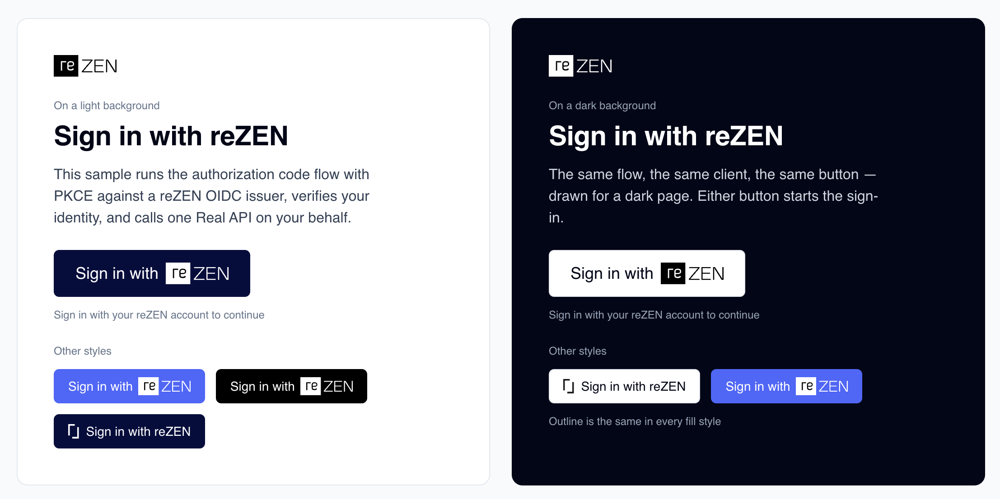

# Sign in with reZEN

## Skills

Claude Code skills under `.claude/skills/`:

- `/pr-review <PR URL> [--comment]` — reviews a pull request to this repository: protocol
  correctness, the two samples' identical `id_token` verifiers, secret and token handling,
  and the bar in `CLAUDE.md`.
- `/review-integration <path> [--type confidential|public]` — checks an outside
  "Sign in with reZEN" implementation against the matching sample.
- `/build-integration <path> [--type confidential|public]` — builds a "Sign in with reZEN"
  integration in another project, in that project's own stack, from the samples.

## Samples

Two runnable samples of "Sign in with reZEN" — OAuth 2.1 authorization code with PKCE and
OpenID Connect. Registration, scopes, token rules, errors, and the security checklist are in
the [integration guide](https://keymaker-oauth.therealbrokerage.com/docs).

|               | `confidential-client/`          | `public-client/`                            |
| ------------- | ------------------------------- | ------------------------------------------- |
| Code runs     | On a server you control         | In the browser, native app, desktop, or CLI |
| Client secret | Yes, held server-side           | None — PKCE alone                           |
| Callback      | Full-page redirect, server-side | Popup (redirect fallback), in the browser   |
| Tokens live   | Server-side session             | In memory; access token mirrored per tab    |

Have a backend? Use `confidential-client/`. A secret in a browser bundle or native binary is
not a secret.

## Run

In either project: `cp .env.example .env`, fill in your registered client's values,
`npm start`, `npm test`. Node ≥ 18, no dependencies. Details in each project's README.

`test-vectors/` holds one signed `id_token` both test suites verify, so the two verifiers
cannot drift.
